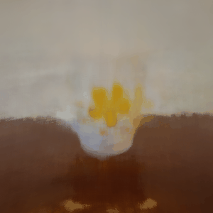

# 🧠 NeRF — Neural Radiance Fields

> 3D scene reconstruction and novel view synthesis using deep learning.



---

## 📌 Overview

This project implements a **Neural Radiance Field (NeRF)** model that reconstructs 3D scenes from multi-view 2D images and synthesizes photorealistic novel views. It includes a trained model pipeline and a web-based interface for interaction.

---

## ✨ Features

- 📸 Train NeRF using multi-view images
- 🎥 Generate novel views exported as GIFs
- 🌐 Web-based interface (FastAPI + HTML/CSS/JS)
- 🧠 Deep learning rendering pipeline (PyTorch)

---

## 🛠️ Tech Stack

| Layer     | Technology               |
|-----------|--------------------------|
| Model     | Python, PyTorch          |
| Backend   | FastAPI                  |
| Frontend  | HTML, CSS, JavaScript    |

---

## 📁 Project Structure

```
NeRF-Project/
│
├── Model/
│   ├── NeRF.py              # Core NeRF model architecture & training
│   └── generate_gif.py      # Novel view synthesis → GIF export
│
├── Web App/
│   ├── backend/             # FastAPI server & API routes
│   └── static/              # Frontend (HTML, CSS, JS)
│
├── sample.gif               # Sample rendered output
├── data/                    # Place your dataset here (excluded from repo)
└── requirements.txt
```

---

## ⚙️ Installation

```bash
pip install -r requirements.txt
```

---

## ▶️ How to Run

### 1. Run the Backend

```bash
cd "Web App/backend"
python main.py
```

### 2. Run the Model

```bash
cd Model
python NeRF.py
```

---

## 📊 Output

- Renders novel views from arbitrary camera angles
- Exports visualizations as animated **GIFs**
- Sample output available at [`sample.gif`](sample.gif)

---

## ⚠️ Note

Large files (datasets, trained model weights) are **excluded** from this repository.

To get started:
1. Add your dataset to the `data/` folder
2. Train the model using `python NeRF.py`
3. Generate output GIFs using `python generate_gif.py`

---

## 📄 License

This project is for academic/research purposes.
